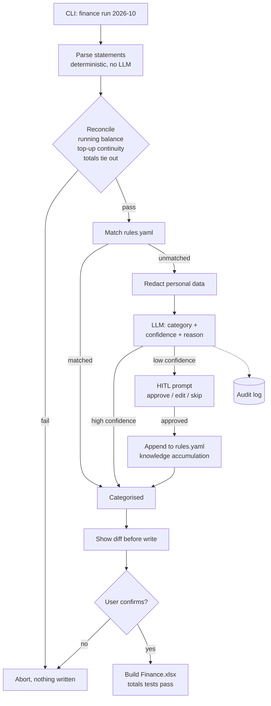

### Finance Agent flow

```mermaid
flowchart TD
    U[CLI: finance run 2026-10] --> P[Parse statements<br/>deterministic, no LLM]
    P --> R{Reconcile<br/>running balance<br/>top-up continuity<br/>totals tie out}
    R -- fail --> STOP[Abort, nothing written]
    R -- pass --> C1[Match rules.yaml]
    C1 -- matched --> OK[Categorised]
    C1 -- unmatched --> RD[Redact personal data]
    RD --> L[LLM: category +<br/>confidence + reason]
    L -- high confidence --> OK
    L -- low confidence --> H[HITL prompt<br/>approve / edit / skip]
    H -- approved --> RU[Append to rules.yaml<br/>knowledge accumulation]
    RU --> OK
    OK --> D[Show diff before write]
    D --> CF{User confirms?}
    CF -- no --> STOP
    CF -- yes --> W[Build Finance.xlsx<br/>totals tests pass]
    L -.-> A[(Audit log)]
```